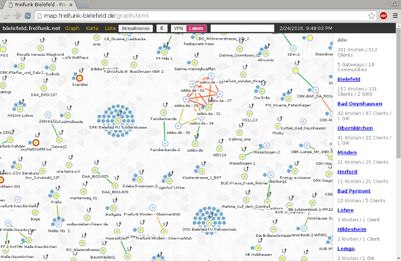

ffmap-d3
========

This repository shows the graph of all nodes in the Freifunk network. This is a geographical map based on OpenStreetMap, a graph of the connections and a plain list.

To use this map, edit the config.js as you wish. Now call ```make``` in this directory and copy the www folder somewhere web accessable.
The data to be displayed can be found in the www/nodes.json file.

For testing, you can start a local webserver in the www folder:
```
python -m SimpleHTTPServer
```
Go to http://localhost:8000 in your browser to test the map.

graph.html
--------
An interactive NodeGraph programmed in the framework d3.js, that shows all nodes, clients and connections between them in your Freifunk mesh-network.

After applying any changes to the file nodes.js, a reload of the page will update the data.



geomap.html
--------
A geographical map with all nodes with known GPS-coordinates.

Links into the map can be done this way:
```
http://example.com/geomap.html?lat=52.11546286&lon=8.67812724&zoom=11
```

list.html
--------
A plain text table with all nodes in the network.
The columns are sortable if you click on the titles in the header-row.
